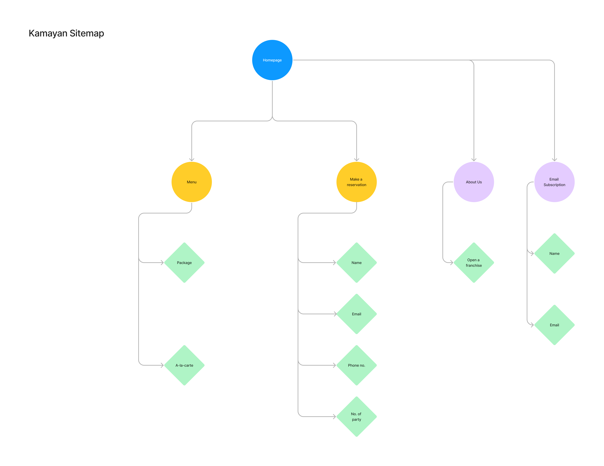

# cpnt200-a2
Assignment 2 - Strapi Project and Model  
author: Myka Peligrino 

## Project Description
- Project Title: Kamayan (Restaurant)  

- About the client:  
For this assignment, I will be creating content for a hypothetical client who owns a Filipino restaurant.  The project title Kamayan which is also the restaurant’s name is inspired by the Filipino’s traditional feast. In this feast, a table is lined with banana leaves and various kinds of foods, usually rice, some fried, and grilled dishes are spread out on the banana leaves. The people then all gather around the table to eat. What makes this feast unique is that people don’t use plates or utensils. Instead, they eat directly from the food spread and use their hand–which translates to *kamay* in Tagalog to scoop the food. In this assignment, I will focus on creating a database of the restaurant’s menu. The menu has options where the customer’s can choose from preset packages which have all the food in a usual Kamayan setting. The packages will vary depending on the serving sizes, add-ons, and complementaries. If the customers don’t want to order from the preset packages, they can choose from the a la-carte menu instead. Their website will also have a feature where the customer’s can book a reservation by themselves.

## Sitemap

## Extras (Relation and components)
- I created a relation between the the Package and Alacarte (one to many)
- I've also made an email component, used to Make a reservations

## Attributions
Images from Unsplash:
- Boodle fight image (https://unsplash.com/photos/Qt8diusVRqg)
- Fried Pork Belly (https://unsplash.com/photos/ENsAKjY3YOs)
- Grilled Fish (https://unsplash.com/photos/cYCUqX97w4c)
- Pork Skewers (https://unsplash.com/photos/VovEm5lCduw)
- Eggplant Omelet (https://unsplash.com/photos/byS7hI3fni0)
- Crab (https://unsplash.com/photos/IHFa5s6xaRE)
- Mussels (https://unsplash.com/photos/4w3QawkfUIA)
- Spring Rolls (https://unsplash.com/photos/broMfoJ0Emg)
- Grilled Chicken (https://unsplash.com/photos/PaaboPF3dVY)
- Pop (https://unsplash.com/photos/sQNq223Rr54)
- Juice (https://unsplash.com/photos/KlVIYmGVRQ8)
- Boodle fight image 2 (https://unsplash.com/photos/sedJnjrUMM8)

## Additional comments
The API token in the `.env` file might not be up to date. Please refer to the API Token in the Brightspace comment submission for the latest one. 