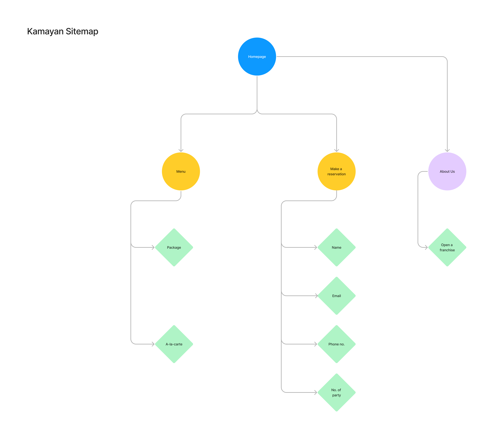

# cpnt200-a2
Assignment 2 - Strapi Project and Model  
author: Myka Peligrino 

## Project Description
- Project Title: Kamayan (Restaurant)  


- About the client:  
For this assignment, I will be creating content for a hypothetical client who owns a Filipino restaurant.  The project title Kamayan which is also the restaurant’s name is inspired by the Filipino’s traditional feast. In this feast, a table is lined with banana leaves and various kinds of foods, usually rice, some fried, and grilled dishes are spread out on the banana leaves. The people then all gather around the table to eat. What makes this feast unique is that people don’t use plates or utensils. Instead, they eat directly from the food spread and use their hand–which translates to *kamay* in Tagalog to scoop the food. In this assignment, I will focus on creating a database of the restaurant’s menu. The menu has options where the customer’s can choose from preset packages which have all the food in a usual Kamayan setting. The packages will vary depending on the serving sizes, add-ons, and complementaries. If the customers don’t want to order from the preset packages, they can choose from the a la-carte menu instead. Their website will also have a feature where the customer’s can book a reservation by themselves.

## Sitemap


## Relation and components

## Attributions
- Boodle fight image from Unsplash (https://unsplash.com/photos/Qt8diusVRqg)
---
# 🚀 Getting started with Strapi

Strapi comes with a full featured [Command Line Interface](https://docs.strapi.io/developer-docs/latest/developer-resources/cli/CLI.html) (CLI) which lets you scaffold and manage your project in seconds.

### `develop`

Start your Strapi application with autoReload enabled. [Learn more](https://docs.strapi.io/developer-docs/latest/developer-resources/cli/CLI.html#strapi-develop)

```
npm run develop
# or
yarn develop
```

### `start`

Start your Strapi application with autoReload disabled. [Learn more](https://docs.strapi.io/developer-docs/latest/developer-resources/cli/CLI.html#strapi-start)

```
npm run start
# or
yarn start
```

### `build`

Build your admin panel. [Learn more](https://docs.strapi.io/developer-docs/latest/developer-resources/cli/CLI.html#strapi-build)

```
npm run build
# or
yarn build
```

## ⚙️ Deployment

Strapi gives you many possible deployment options for your project. Find the one that suits you on the [deployment section of the documentation](https://docs.strapi.io/developer-docs/latest/setup-deployment-guides/deployment.html).

## 📚 Learn more

- [Resource center](https://strapi.io/resource-center) - Strapi resource center.
- [Strapi documentation](https://docs.strapi.io) - Official Strapi documentation.
- [Strapi tutorials](https://strapi.io/tutorials) - List of tutorials made by the core team and the community.
- [Strapi blog](https://docs.strapi.io) - Official Strapi blog containing articles made by the Strapi team and the community.
- [Changelog](https://strapi.io/changelog) - Find out about the Strapi product updates, new features and general improvements.

Feel free to check out the [Strapi GitHub repository](https://github.com/strapi/strapi). Your feedback and contributions are welcome!

## ✨ Community

- [Discord](https://discord.strapi.io) - Come chat with the Strapi community including the core team.
- [Forum](https://forum.strapi.io/) - Place to discuss, ask questions and find answers, show your Strapi project and get feedback or just talk with other Community members.
- [Awesome Strapi](https://github.com/strapi/awesome-strapi) - A curated list of awesome things related to Strapi.

---

<sub>🤫 Psst! [Strapi is hiring](https://strapi.io/careers).</sub>
